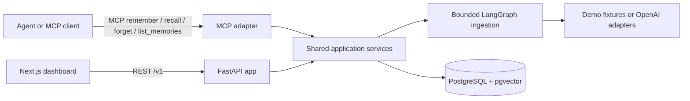
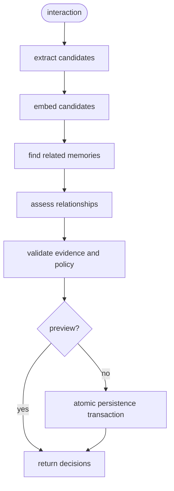

# MemoryOS architecture

MemoryOS is deliberately split into a dashboard and one small Python service. The service owns all decisions about what to remember, how memories relate, and how recall is ranked. REST and MCP are two transport adapters over the same application services.



## Runtime boundaries

- `apps/web` renders the engineering dashboard and keeps the owner token in React memory only. The browser never receives an OpenAI key.
- `apps/api` contains REST routes, the MCP server, ingestion, recall, lifecycle mutations, and persistence adapters.
- PostgreSQL stores four concepts: scopes, interactions, immutable memory versions, and memory events. pgvector stores the embedding alongside each memory version.
- `apps/api/src/memoryos/seed/catalog.py` is an authored, finite demo catalog. Its deterministic embeddings and structured outputs are labelled fixture data; they are not recordings from a live model.

The fixed public demo scope is `00000000-0000-0000-0000-000000000001`. The private live scope is `00000000-0000-0000-0000-000000000002`. Public access can read the demo scope, run allowlisted recall queries, and preview allowlisted ingestion scenarios. Mutations, arbitrary input, live mode, and other scopes require `OWNER_API_TOKEN`.

## Ingestion flow

The graph is bounded and synchronous:



The model proposes atomic candidates and relationship labels. Deterministic policy functions then verify evidence, minimum importance/confidence, duplicate targets, scope/model identity, and temporal rules. A provider failure cannot partially advance a memory scope. Committed requests require an idempotency key so a retry returns the existing interaction instead of duplicating it.

Relationship outcomes are `created`, `reinforced`, `superseded`, `disputed`, `skipped`, or `rejected`. A changed fact creates a new immutable version and marks the older version superseded. The old row and its event remain queryable. An unclear conflict remains disputed for review. Forgetting is a soft state transition across a lineage; history remains visible for audit and it should not be described as privacy erasure.

## Recall score

MemoryOS filters eligible versions by scope, status, effective/expiry time, and embedding model before ranking. It uses exact cosine search for the portfolio-sized dataset and combines the result with stored signals:

```text
S = clamp(cosine_similarity, 0, 1)
I = importance
C = confidence
R = 2 ^ (-days_since_last_confirmation / half_life_for_type)
F = min(1, log(1 + reinforcement_count) / log(6))
score = 0.55S + 0.15I + 0.10R + 0.10F + 0.10C
```

Initial half-lives are 180 days for preferences, 365 for semantic facts, 30 for episodic memories, and 180 for procedures. Decay is calculated at recall time and does not delete or rewrite a memory. Recall Lab sends the same query, candidate snapshot, filters, relevance floor, and evaluation time to both the naive and MemoryOS rankings.

Importance and confidence are bounded policy signals. Confidence is a heuristic evidence-strength score, not a probability or a calibrated certainty claim.

## Why this stays small

There is no queue, swarm, graph database, background decay job, document ingestion pipeline, or generated answer chatbot. LLM calls are isolated behind provider interfaces; persistence, versioning, decay, and ranking remain ordinary Python that can be unit tested and explained in an interview.
